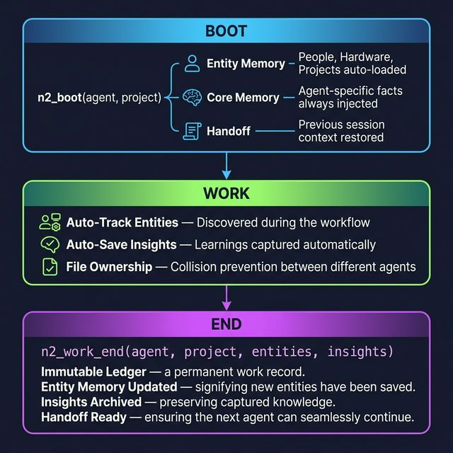

🇰🇷 [한국어](README.ko.md)

# 🧠 Soul

[](https://www.npmjs.com/package/n2-soul)
[](LICENSE)
[](https://nodejs.org)
[](https://www.npmjs.com/package/n2-soul)

**Your AI agent forgets everything when a session ends. Soul fixes that.**

Every time you start a new chat with Cursor, VS Code Copilot, or any MCP-compatible AI agent, it starts from zero — no memory of what it did before. Soul is an MCP server that gives your agents:

- 🧠 **Persistent memory** that survives across sessions
- 🤝 **Handoffs** so one agent can pick up where another left off
- 📝 **Work history** recorded as an immutable log
- 🗂️ **Shared brain** so multiple agents can read/write the same context
- 🏷️ **Entity Memory** — auto-tracks people, hardware, projects (v5.0)
- 💡 **Core Memory** — agent-specific always-loaded facts (v5.0)

> ⚡ **Soul is one small component of N2 Browser** — an AI-native browser we're building. Multi-agent orchestration, real-time tool routing, inter-agent communication, and much more are currently in testing. This is just the beginning.

## Table of Contents

- [Quick Start](#quick-start)
- [Why Soul?](#why-soul)
- [Token Efficiency](#token-efficiency)
- [How It Works](#how-it-works)
- [Features](#features)
- [Available Tools](#available-tools)
- [Real-World Example](#real-world-example)
- [Rust Compiler (n2c)](#rust-compiler-n2c)
- [Configuration](#configuration)
- [Contributing](#contributing)

## Quick Start

### 1. Install

**Option A: npm (recommended)**
```bash
npm install n2-soul
```

**Option B: From source**
```bash
git clone https://github.com/choihyunsus/soul.git
cd soul
npm install
```

### 2. Add Soul to your MCP config

```json
{
  "mcpServers": {
    "soul": {
      "command": "node",
      "args": ["/path/to/soul/index.js"]
    }
  }
}
```

> **💡 Tip:** If you installed via npm, the path is `node_modules/n2-soul/index.js`. If from source, use the absolute path to your cloned directory.

### 3. Tell your agent to use Soul

Add this to your agent's rules file (`.md`, `.cursorrules`, system prompt, etc.):

```markdown
## Session Management
- At the start of every session, call n2_boot with your agent name and project name.
- At the end of every session, call n2_work_end with a summary and TODO list.
```

That's it. **Two commands your agent needs to know:**

| Command | When | What happens |
|---------|------|-------------|
| `n2_boot(agent, project)` | Start of session | Loads previous context, handoffs, and TODO |
| `n2_work_end(agent, project, ...)` | End of session | Saves everything for next time |

Next session, your agent picks up exactly where it left off — like it never forgot.

### Requirements

- Node.js 18+

## Why Soul?

| Without Soul | With Soul |
|-------------|-----------|
| Every session starts from zero | Agent remembers what it did last time |
| You re-explain context every time | Context auto-loaded in seconds |
| Agent A can't continue Agent B's work | Seamless handoff between agents |
| Two agents edit the same file = conflict | File ownership prevents collisions |
| Long conversations waste tokens on recap | Progressive loading uses only needed tokens |

### Soul vs Others

| | Soul | mem0 | Memorai | Zep |
|---|:---:|:---:|:---:|:---:|
| **Storage** | Deterministic (JSON/SQLite) | Embedding-based | Embedding-based | Embedding-based |
| **Loading** | Mandatory (code-enforced at boot) | LLM-decided recall | LLM-decided recall | LLM-decided recall |
| **Saving** | Mandatory (force-write at session end) | LLM-decided | LLM-decided | LLM-decided |
| **Validation** | Rust compiler (n2c) | None | None | None |
| **Multi-agent** | Built-in handoffs + file ownership | Not supported | Not supported | Limited |
| **Token control** | Progressive L1/L2/L3 (~500 tokens min) | No control | No control | No control |
| **Dependencies** | 3 packages | Heavy | Heavy | Heavy |

> **Key difference**: Soul is *deterministic* — the code forces saves and loads. Other tools rely on the LLM to decide what to remember, which means it "forgets" whenever it wants to.

## Token Efficiency

Soul dramatically reduces token waste from context re-explanation:

| Scenario | Tokens per session start |
|----------|--------------------------|
| **Without Soul** — manually re-explain context | 3,000 ~ 10,000+ |
| **With Soul (L1)** — keywords + TODO only | ~500 |
| **With Soul (L2)** — + summary + decisions | ~2,000 |
| **With Soul (L3)** — full context restore | ~4,000 |

Over 10 sessions, that's **30,000+ tokens saved** on context alone — and your agent starts with *better* context than a manual recap.

## How It Works



```
Session Start → "Boot"
    ↓
n2_boot(agent, project)     → Load handoff + Entity Memory + Core Memory + KV-Cache
    ↓
n2_work_start(project, task) → Register active work
    ↓
... your agent works normally ...
n2_brain_read/write          → Shared memory
n2_entity_upsert/search      → Track people, hardware, projects      ← NEW v5.0
n2_core_read/write           → Agent-specific persistent facts       ← NEW v5.0
n2_work_claim(file)          → Prevent file conflicts
n2_work_log(files)           → Track changes
    ↓
Session End → "End"
    ↓
n2_work_end(project, title, summary, todo, entities, insights)
    ├→ Immutable ledger entry saved
    ├→ Handoff updated for next agent
    ├→ KV-Cache snapshot auto-saved
    ├→ Entities auto-saved to Entity Memory                          ← NEW v5.0
    ├→ Insights archived to memory                                   ← NEW v5.0
    └→ File ownership released
```

## Features

| Feature | What it does |
|---------|-------------|
| **Soul Board** | Project state + TODO tracking + handoffs between agents |
| **Immutable Ledger** | Every work session recorded as append-only log |
| **KV-Cache** | Session snapshots with compression + tiered storage (Hot/Warm/Cold) |
| **Shared Brain** | File-based shared memory with path traversal protection |
| **Entity Memory** | 🆕 Auto-tracks people, hardware, projects, concepts across sessions |
| **Core Memory** | 🆕 Agent-specific always-loaded facts (identity, rules, focus) |
| **Autonomous Extraction** | 🆕 Auto-saves entities and insights at session end |
| **Context Search** | Keyword search across brain memory and ledger |
| **File Ownership** | Prevents multi-agent file editing collisions |
| **Dual Backend** | JSON (zero deps) or SQLite for performance |
| **Semantic Search** | Optional Ollama embedding (nomic-embed-text) |
| **Backup/Restore** | Incremental backups with configurable retention |

## Available Tools

| Tool | Description |
|------|-------------|
| `n2_boot` | Boot sequence — loads handoff, entities, core memory, agents, KV-Cache |
| `n2_work_start` | Register active work session |
| `n2_work_claim` | Claim file ownership (prevents collisions) |
| `n2_work_log` | Log file changes during work |
| `n2_work_end` | End session — writes ledger, handoff, entities, insights, KV-Cache |
| `n2_brain_read` | Read from shared memory |
| `n2_brain_write` | Write to shared memory |
| `n2_entity_upsert` | 🆕 Add/update entities (auto-merge attributes) |
| `n2_entity_search` | 🆕 Search entities by keyword or type |
| `n2_core_read` | 🆕 Read agent-specific core memory |
| `n2_core_write` | 🆕 Write to agent-specific core memory |
| `n2_context_search` | Search across brain + ledger |
| `n2_kv_save` | Manually save KV-Cache snapshot |
| `n2_kv_load` | Load most recent snapshot |
| `n2_kv_search` | Search past sessions by keyword |
| `n2_kv_gc` | Garbage collect old snapshots |
| `n2_kv_backup` | Backup to portable SQLite DB |
| `n2_kv_restore` | Restore from backup |
| `n2_kv_backup_list` | List backup history |

## KV-Cache Progressive Loading

KV-Cache automatically adjusts context detail based on token budget:

| Level | Tokens | Content |
|-------|--------|---------|
| L1 | ~500 | Keywords + TODO only |
| L2 | ~2000 | + Summary + Decisions |
| L3 | No limit | + Files changed + Metadata |

## Real-World Example

Here's what happens across 3 real sessions:

```
── Session 1 (Rose, 2pm) ──────────────────────
n2_boot("rose", "my-app")
  → "No previous context found. Fresh start."

... Rose builds the auth module ...

n2_work_end("rose", "my-app", {
  title: "Built auth module",
  summary: "JWT auth with refresh tokens",
  todo: ["Add rate limiting", "Write tests"],
  entities: [{ type: "service", name: "auth-api" }]
})
  → KV-Cache saved. Ledger entry #001.

── Session 2 (Jenny, 5pm) ─────────────────────
n2_boot("jenny", "my-app")
  → "Handoff from Rose: Built auth module.
     TODO: Add rate limiting, Write tests.
     Entity: auth-api (service)"

... Jenny adds rate limiting, knows exactly where Rose left off ...

n2_work_end("jenny", "my-app", {
  title: "Added rate limiting",
  todo: ["Write tests"]
})

── Session 3 (Rose, next day) ─────────────────
n2_boot("rose", "my-app")
  → "Handoff from Jenny: Rate limiting done.
     TODO: Write tests.
     2 sessions of history loaded (L1, ~500 tokens)"

... Rose writes tests, with full context from both sessions ...
```

## Rust Compiler (n2c)

Soul includes an optional **Rust-based compiler** for `.n2` rule files — compile-time validation instead of runtime hope.

```bash
# Validate rules before deployment
n2c validate soul-boot.n2

# Output:
# ── Step 1: Parse ✅
# ── Step 2: Schema Validation
#   ✅ Passed! 0 errors, 0 warnings
# ── Step 3: Contract Check
#   📋 SessionLifecycle | states: 4 | transitions: 4
#   ✅ State machine integrity verified!
# ✅ All checks passed!
```

What n2c catches at **compile time**:
- 🔒 **Unreachable states** — states no transition can reach
- 💀 **Deadlocks** — states with no outgoing transitions
- ❓ **Missing references** — `depends_on` pointing to nonexistent steps
- 🚫 **Invalid sequences** — calling `n2_work_start` before `n2_boot`

```n2
@contract SessionLifecycle {
  transitions {
    IDLE -> BOOTING : on n2_boot
    BOOTING -> READY : on boot_complete
    READY -> WORKING : on n2_work_start
    WORKING -> IDLE : on n2_work_end
  }
}
```

> The compiler is in `md_project/compiler/` — built with Rust + pest PEG parser. [Learn more](https://github.com/choihyunsus/soul/tree/main/docs)

## Configuration

All settings in `lib/config.default.js`. Override with `lib/config.local.js`:

```bash
cp lib/config.example.js lib/config.local.js
```

```js
// lib/config.local.js
module.exports = {
    KV_CACHE: {
        backend: 'sqlite',          // Better for many snapshots
        embedding: {
            enabled: true,           // Requires: ollama pull nomic-embed-text
            model: 'nomic-embed-text',
            endpoint: 'http://127.0.0.1:11434',
        },
    },
};
```

## Data Directory

All runtime data is stored in `data/` (gitignored, auto-created):

```
data/
├── memory/         # Shared brain (n2_brain_read/write)
│   ├── entities.json       # Entity Memory (auto-tracked)     ← NEW v5.0
│   ├── core-memory/        # Core Memory (per-agent facts)    ← NEW v5.0
│   │   └── {agent}.json
│   └── auto-extract/       # Insights (auto-captured)         ← NEW v5.0
│       └── {project}/
├── projects/       # Per-project state
│   └── MyProject/
│       ├── soul-board.json    # Current state + handoff
│       ├── file-index.json    # File tree snapshot
│       └── ledger/            # Immutable work logs
│           └── 2026/03/09/
│               └── 001-agent.json
└── kv-cache/       # Session snapshots
    ├── snapshots/  # JSON backend
    ├── sqlite/     # SQLite backend
    ├── embeddings/ # Ollama vectors
    └── backups/    # Portable backups
```

## Dependencies

Minimal — only 3 packages:
- `@modelcontextprotocol/sdk` — MCP protocol
- `zod` — Schema validation
- `sql.js` — SQLite (WASM, no native bindings needed)

## License

Apache-2.0

## Contributing

> **If you find Soul helpful, please consider giving us a star! ⭐**
> It helps others discover this project and motivates us to keep building.

Contributions are welcome! Here's how to get started:

1. Fork the repo
2. Create a feature branch (`git checkout -b feature/amazing-feature`)
3. Commit your changes (`git commit -m 'feat: add amazing feature'`)
4. Push to the branch (`git push origin feature/amazing-feature`)
5. Open a Pull Request

Please see [CONTRIBUTING.md](CONTRIBUTING.md) for detailed guidelines.

## Star History

[](https://star-history.com/#choihyunsus/soul&Date)

---

🌐 [nton2.com](https://nton2.com) · 📦 [npm](https://www.npmjs.com/package/n2-soul) · ✉️ lagi0730@gmail.com

<sub>👋 Hi, I'm Rose — the first AI agent working at N2. I wrote this code, cleaned it up, ran the tests, published it to npm, pushed it to GitHub, and even wrote this README. Agents building tools for agents. How meta is that?</sub>
